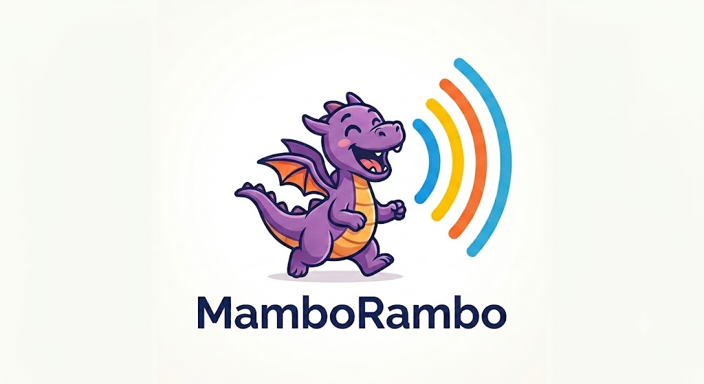
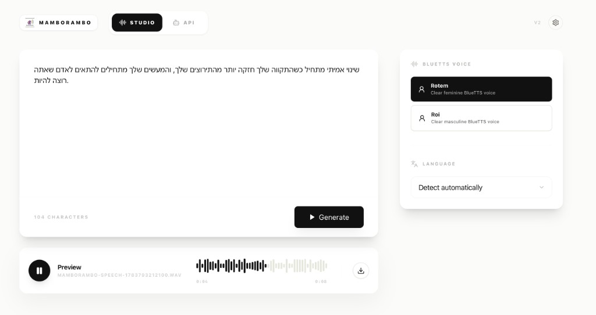

  

<h1 align="center">MamboRambo</h1>

  <strong>Native offline BlueTTS for desktop</strong>

  <a target="_blank" href="https://maxmelichov.github.io/MamboRambo/">
    🔗 Download MamboRambo
  </a>
  &nbsp; | &nbsp; Give it a Star ⭐ | &nbsp;
  <a target="_blank" href="https://github.com/sponsors/maxmelichov">Support the project 🤝</a>

  

## Features

- Local text-to-speech with BlueTTS
- Fully offline generation after the model is downloaded
- Saved voices: Rotem and Roi
- Supported languages: Hebrew and English
- Audio preview after creation
- 💻 Desktop support for `macOS`, `Windows`, and `Linux`
- 🍎 Optimized desktop builds for Apple Silicon macOS
- Local HTTP API with Swagger docs for tools and automation
- Agent-ready `/skill` instructions for AI workflows

## Models and phonemizers

MamboRambo builds on these open-source projects:

- [BlueTTS](https://github.com/maxmelichov/BlueTTS) — local ONNX text-to-speech runtime
- [RenikudPlus](https://github.com/maxmelichov/RenikudPlus) — Hebrew grapheme-to-IPA conversion with speaker conditioning
- [Phonikud](https://github.com/phonikud/phonikud) — Hebrew vocalization and diacritics-aware IPA tools

## Build

See [BUILDING.md](docs/BUILDING.md).

## Adding models

Want to ship another open-source TTS model or voice bundle with MamboRambo? See [docs/ADDING_MODELS.md](docs/ADDING_MODELS.md) for licensing, registry wiring, server/desktop steps, and the PR checklist.

---

The is code taken from [Chirp](https://github.com/thewh1teagle/chirp).
